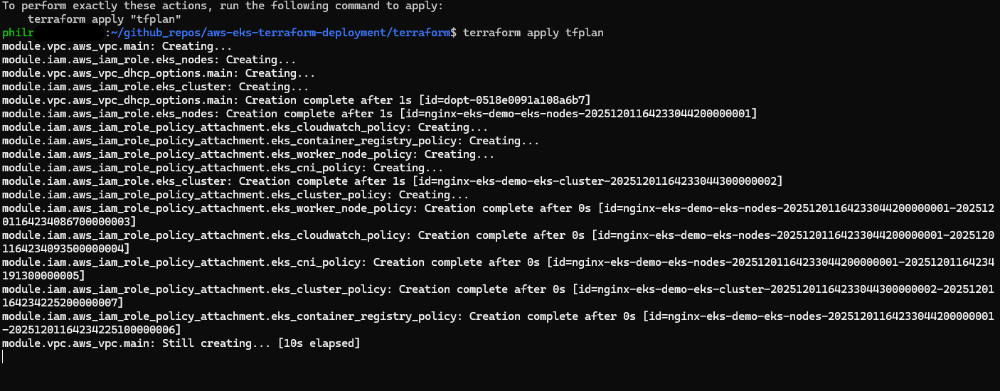
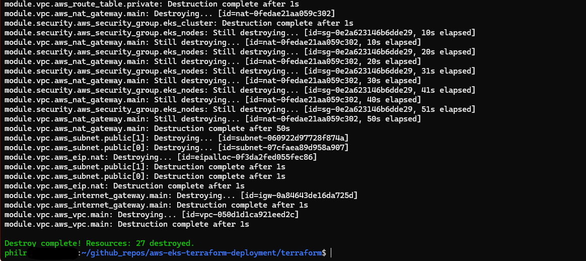

# AWS EKS Terraform Deployment

## Overview

This project uses **[Terraform](https://www.terraform.io/downloads)** to deploy a highly available **[NGINX](https://nginx.org/)** service on AWS using **[Amazon EKS (Elastic Kubernetes Service)](https://aws.amazon.com/eks/)**. The application runs in a Kubernetes cluster with managed node groups, sitting behind a **LoadBalancer** service that creates an AWS Elastic Load Balancer.

Additional features include:

- VPC with public and private subnets across multiple availability zones
- NAT Gateway for private subnet internet access
- EKS cluster with managed node groups
- CloudWatch logging for cluster and container logs
- Security groups with least-privilege access
- IAM roles following AWS best practices
- Support for both YAML manifests and Helm chart deployment approaches
- Modular, reusable Terraform code structure

This project was designed as a proof-of-concept to demonstrate EKS deployment capabilities as well as provide a robust, repeatable, and secure way to deploy this infrastructure using Terraform.

## How to Deploy

### Prerequisites

- **Terraform** (>= 1.0)
- **AWS CLI** with credentials configured (`aws configure`)
- **kubectl** installed and configured
- **Helm** (optional, for Helm deployment approach)
- AWS account with appropriate IAM permissions for:
  - EKS (cluster creation, node group management)
  - VPC (VPC, subnets, Internet Gateway, NAT Gateway)
  - EC2 (for node instances)
  - IAM (role creation and policy attachment)
  - CloudWatch (log group creation)

### Steps

1. **Clone the repository**
   ```bash
   git clone <repository-url>
   cd aws-eks-terraform-deployment
   ```

2. **Navigate to the terraform directory**
   ```bash
   cd terraform
   ```

3. **Initialize Terraform**
   ```bash
   terraform init
   ```

4. **(Optional)** Create and customize `terraform.tfvars`
   
   Copy the example file and customize as needed:
   ```bash
   cp terraform.tfvars.example terraform.tfvars
   ```
   
   Edit `terraform.tfvars` to customize:
   - AWS region
   - Cluster name
   - Node group configuration
   - VPC CIDR blocks
   - Application settings

5. **Review the plan**
   ```bash
   terraform plan
   ```
   
   **(Optional)** Save the plan to a file for review:
   ```bash
   terraform plan -out=tfplan
   ```
   
   Review the plan file:
   ```bash
   terraform show tfplan
   ```
   
   This allows you to:
   - Review the plan in detail before applying
   - Share the plan with team members for review
   - Keep a record of what will be changed
   - Apply the exact plan later with `terraform apply tfplan`

6. **Apply the infrastructure**
   ```bash
   terraform apply
   ```
   
   Or if you created a plan file:
   ```bash
   terraform apply tfplan
   ```
   
   This will create:
   - VPC with public and private subnets
   - Internet Gateway and NAT Gateway
   - Security groups for EKS cluster and nodes
   - IAM roles for EKS cluster and node groups
   - EKS cluster with managed node group
   - CloudWatch log groups
   - (Optional) Kubernetes namespace and nginx deployment (if `deploy_with_yaml = true`)

   **Note:** EKS cluster creation typically takes 10-15 minutes. The node group will be created after the cluster is ready.

   Example output from `terraform apply`:
   
   

7. **Configure kubectl** (if not done automatically)
   
   After the cluster is created, configure kubectl:
   ```bash
   aws eks update-kubeconfig --region <region> --name <cluster-name>
   ```
   
   Or use the output from Terraform:
   ```bash
   terraform output kubeconfig_command
   ```

8. **Verify cluster access**
   ```bash
   kubectl get nodes
   kubectl get pods --all-namespaces
   ```

9. **Access the application**

   If you deployed with Terraform (`deploy_with_yaml = true`), get the LoadBalancer URL:
   ```bash
   kubectl get service nginx -n default
   ```
   
   Or use Terraform output:
   ```bash
   terraform output nginx_service_url
   ```
   
   Access the nginx service at the LoadBalancer URL.

---

## Choose Your Deployment Approach

This project supports two approaches for deploying the Kubernetes application:

### Approach 1: Terraform-Managed YAML (Default)

**When to use:** Fully automated deployment, everything in Terraform, idempotent.

**How it works:**
- Set `deploy_with_yaml = true` in `terraform.tfvars` (default)
- Terraform applies Kubernetes manifests using the `kubernetes` provider
- Application is deployed automatically during `terraform apply`

**Pros:**
- Fully automated
- Idempotent (Terraform manages state)
- Single command deployment
- Version controlled with infrastructure

**Cons:**
- Less "real-world" (most teams use kubectl/Helm directly)
- Requires Kubernetes provider configuration

### Approach 2: Manual Deployment (kubectl or Helm)

**When to use:** More realistic workflow, demonstrates kubectl/Helm skills, manual control.

**How it works:**
- Set `deploy_with_yaml = false` in `terraform.tfvars`
- Terraform only creates the EKS cluster
- Deploy application manually using kubectl or Helm

#### Option 2a: Deploy with kubectl (Plain YAML)

```bash
# After cluster is created and kubectl is configured
kubectl apply -f ../k8s/manifests/namespace.yaml
kubectl apply -f ../k8s/manifests/deployment.yaml
kubectl apply -f ../k8s/manifests/service.yaml

# Check status
kubectl get pods -n default
kubectl get service nginx -n default
```

#### Option 2b: Deploy with Helm

```bash
# After cluster is created and kubectl is configured
# Install Helm chart
helm install my-app ../k8s/helm/my-app

# Or customize values
helm install my-app ../k8s/helm/my-app --set replicaCount=3

# Check status
helm list
kubectl get pods -n default
kubectl get service -n default
```

**Pros:**
- More realistic workflow
- Demonstrates kubectl/Helm knowledge
- More flexible for application updates
- Industry-standard approach

**Cons:**
- Manual steps required
- Not fully automated
- Application state not in Terraform

---

## Assumptions and Notes

- You are running in an environment where `aws` CLI credentials are already configured.
- You have permission to create IAM roles, EKS clusters, VPC resources, and related infrastructure.
- Resources that can potentially cause conflicts (e.g., already existing resources with the same names) do not exist.
- The EKS cluster creation takes approximately 10-15 minutes. Node group creation takes an additional 5-10 minutes.
- This project is simplified and certain hard-coded values may persist for simplicity. In a true production environment, more robust configuration options would be available.
- By default, the EKS API server endpoint is publicly accessible. In production, restrict `public_access_cidrs` to specific IP ranges.

---

## Security Considerations

- **Private Subnets:** EKS nodes run in private subnets for enhanced security
- **NAT Gateway:** Nodes access the internet through NAT Gateway (no direct internet access)
- **Security Groups:** Restrictive security groups with least-privilege access
- **IAM Roles:** Separate IAM roles for cluster and nodes, using AWS managed policies where possible
- **CloudWatch Logs:** Cluster and container logs are sent to CloudWatch for auditing and troubleshooting
- **Network Segmentation:** Public subnets for load balancers, private subnets for compute
- **API Server Access:** Consider restricting `public_access_cidrs` in production environments

---

## Design Choices/Rationale

The goal was to create a simple, production-adjacent deployment that demonstrates EKS best practices while maintaining security and scalability.

### Why EKS?

**Amazon EKS** was chosen as the Kubernetes platform for the following reasons:

- **Managed Control Plane:** AWS manages the Kubernetes control plane, reducing operational overhead
- **AWS Integration:** Native integration with AWS services (VPC, IAM, CloudWatch, Load Balancers)
- **Scalability:** Easy to scale node groups and applications
- **Production-Ready:** Suitable for production workloads with high availability
- **Industry Standard:** Kubernetes is the de facto standard for container orchestration

### Architecture Decisions

1. **Private Subnets for Nodes:**
   - EKS nodes run in private subnets for security
   - NAT Gateway provides outbound internet access
   - No direct inbound internet access to nodes

2. **Managed Node Groups:**
   - Easier to manage than self-managed node groups
   - Automatic updates and patching
   - Integrated with AWS services

3. **CloudWatch Logging:**
   - Enabled for all cluster log types (api, audit, authenticator, controllerManager, scheduler)
   - Container logs streamed to CloudWatch
   - 7-day retention for cost optimization

4. **Modular Structure:**
   - Separate modules for VPC, security, IAM, and EKS
   - Reusable and maintainable
   - Follows Terraform best practices

5. **Dual Deployment Approaches:**
   - Terraform-managed YAML for automation
   - Manual kubectl/Helm for realistic workflows
   - Demonstrates flexibility and knowledge of multiple tools

### Comparison: YAML vs Helm

| Aspect | Plain YAML | Helm |
|--------|-----------|------|
| **Simplicity** | ✅ Very simple | ⚠️ Template syntax |
| **Reusability** | ❌ Copy/paste | ✅ Parameterized |
| **Industry Standard** | ⚠️ Common but basic | ✅ Industry standard |
| **For This Assignment** | ✅ Default approach | ✅ Alternative approach |

Both approaches are included to demonstrate:
- Knowledge of Kubernetes fundamentals (YAML)
- Advanced tooling knowledge (Helm)
- Flexibility in deployment strategies

---

## Areas for Improvement (if given more time)

- **Remote State Backend:** Store Terraform state in S3 with DynamoDB locking for team collaboration
- **Multi-Environment Support:** Use Terraform workspaces or Terragrunt for dev/staging/prod separation
- **SSL/HTTPS:** Add ACM certificate and ingress controller (e.g., AWS Load Balancer Controller with ALB)
- **Auto-Scaling:** Implement Cluster Autoscaler and Horizontal Pod Autoscaler (HPA)
- **Monitoring:** Add Prometheus and Grafana for advanced metrics and visualization
- **Log Aggregation:** Consider Fluent Bit/Fluentd for advanced log forwarding
- **Network Policies:** Implement Kubernetes network policies for pod-to-pod communication control
- **Secrets Management:** Integrate AWS Secrets Manager or external-secrets operator
- **CI/CD:** ~~Add GitHub Actions workflow for automated deployment~~ ✅ **Implemented!** See CI/CD Pipeline section below
- **Blue/Green Deployments:** Implement deployment strategies for zero-downtime updates
- **Cost Optimization:** Consider Spot instances for node groups, Fargate for serverless workloads
- **Disaster Recovery:** Add backup and restore procedures for etcd and application data
- **Security Hardening:** Implement pod security policies, OPA Gatekeeper, or Pod Security Standards
- **Service Mesh:** Consider Istio or AWS App Mesh for advanced traffic management

---

## Project Structure

```
.
├── terraform/
│   ├── main.tf                  # Root module (orchestrates all modules)
│   ├── variables.tf             # Root-level variables
│   ├── outputs.tf              # Root-level outputs
│   ├── versions.tf              # Provider version constraints
│   ├── terraform.tfvars.example # Example variable values
│   ├── .tflint.hcl              # tflint configuration
│   └── modules/
│       ├── vpc/                 # VPC, subnets, IGW, NAT Gateway
│       │   ├── main.tf
│       │   ├── variables.tf
│       │   └── outputs.tf
│       ├── security/            # Security groups
│       │   ├── main.tf
│       │   ├── variables.tf
│       │   └── outputs.tf
│       ├── iam/                 # IAM roles for EKS
│       │   ├── main.tf
│       │   ├── variables.tf
│       │   └── outputs.tf
│       └── eks/                 # EKS cluster and node group
│           ├── main.tf
│           ├── variables.tf
│           └── outputs.tf
├── k8s/
│   ├── manifests/               # Plain YAML approach
│   │   ├── namespace.yaml
│   │   ├── deployment.yaml
│   │   └── service.yaml
│   └── helm/                    # Helm chart approach
│       └── my-app/
│           ├── Chart.yaml
│           ├── values.yaml
│           └── templates/
│               ├── deployment.yaml
│               ├── service.yaml
│               ├── namespace.yaml
│               └── _helpers.tpl
├── .github/
│   └── workflows/
│       └── terraform-checks.yml # CI/CD pipeline for linting and security
├── README.md                    # This file
└── .gitignore                   # Git ignore rules
```

---

## CI/CD Pipeline

This repository includes a GitHub Actions workflow that automatically runs code quality and security checks on Terraform code.

### What It Does

The workflow (`.github/workflows/terraform-checks.yml`) runs on:
- Pushes to `main` branch
- Pull requests to `main` branch
- Only when Terraform files are modified

### Checks Performed

1. **tflint** - Terraform linter that checks for:
   - Best practices and conventions
   - Deprecated syntax
   - Unused declarations
   - AWS provider-specific rules

2. **tfsec** - Security scanner that checks for:
   - Security misconfigurations
   - Exposed secrets
   - Insecure defaults
   - AWS security best practices

3. **terraform fmt** - Formatting check to ensure consistent code style

4. **terraform validate** - Validates Terraform syntax and configuration

### Viewing Results

- Check the "Actions" tab in GitHub to see workflow runs
- Green checkmark = all checks passed
- Red X = issues found (review the logs)

### Running Locally

You can run these checks locally before pushing:

```bash
cd terraform

# Install tflint (if not already installed)
# macOS: brew install tflint
# Linux: See https://github.com/terraform-linters/tflint

# Run tflint
tflint --init
tflint

# Install tfsec (if not already installed)
# macOS: brew install tfsec
# Linux: See https://aquasecurity.github.io/tfsec/latest/getting-started/installation/

# Run tfsec
tfsec .

# Check formatting
terraform fmt -check -recursive

# Validate
terraform validate
```

---

## Cleanup / Destroying Resources

### If Using Terraform for Deployment (`deploy_with_yaml = true`)

If you deployed the application using Terraform (default approach), you can destroy all resources with a single command:

```bash
cd terraform
terraform destroy
```

This will destroy:
- Kubernetes resources (deployment, service, namespace)
- EKS cluster and node group
- Security groups
- IAM roles
- VPC and all networking components (NAT Gateway, Internet Gateway, subnets, route tables)
- CloudWatch log groups

**Note:** Terraform will prompt for confirmation before destroying resources. Review the destruction plan carefully.

Example output from `terraform destroy`:



### If Using Manual Deployment (kubectl/Helm)

If you deployed the application manually using kubectl or Helm, you should delete the Kubernetes resources first:

```bash
# If using kubectl
kubectl delete -f ../k8s/manifests/

# If using Helm
helm uninstall my-app
```

Then destroy the infrastructure:

```bash
cd terraform
terraform destroy
```

### Important Notes

- **Destruction Time:** EKS cluster deletion typically takes 5-10 minutes. NAT Gateway deletion may take a few minutes as well.
- **Cost:** Ensure you destroy resources when not in use to avoid unnecessary AWS charges.
- **Data Loss:** Destroying resources will permanently delete all data. Make sure to backup any important data before destruction.
- **Dependencies:** Terraform will automatically handle resource dependencies and destroy resources in the correct order.

---

## Troubleshooting

### Cluster creation is slow
- EKS cluster creation typically takes 10-15 minutes. This is normal.
- Node group creation takes an additional 5-10 minutes after the cluster is ready.

### kubectl access issues
- Ensure AWS credentials are configured: `aws sts get-caller-identity`
- Verify kubectl is configured: `aws eks update-kubeconfig --region <region> --name <cluster-name>`
- Check IAM permissions for EKS cluster access

### Nodes not joining cluster
- Check node group status in AWS Console
- Verify security groups allow communication between cluster and nodes
- Check CloudWatch logs for node group issues

### Application not accessible
- Verify LoadBalancer service is created: `kubectl get service -n default`
- Check LoadBalancer status in AWS Console (ELB)
- Ensure security groups allow traffic on port 80/443
- Wait a few minutes for the LoadBalancer to be provisioned

### Terraform provider errors
- Ensure Terraform and provider versions are compatible
- Run `terraform init -upgrade` to update providers
- Check AWS credentials and permissions

---

## License

MIT License
